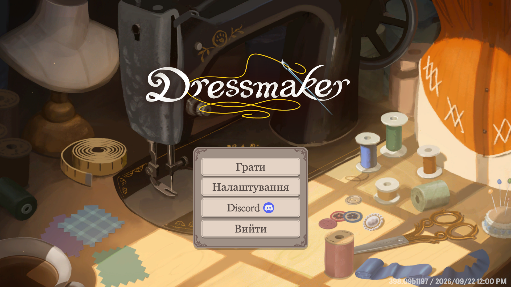
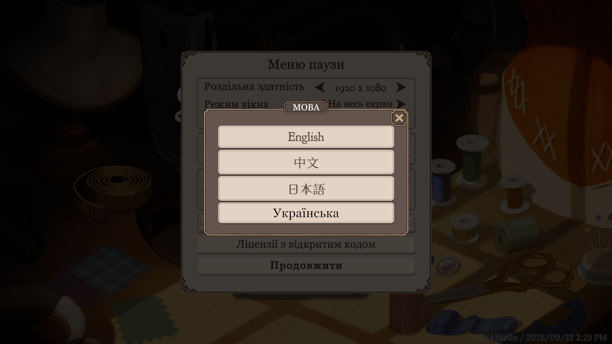
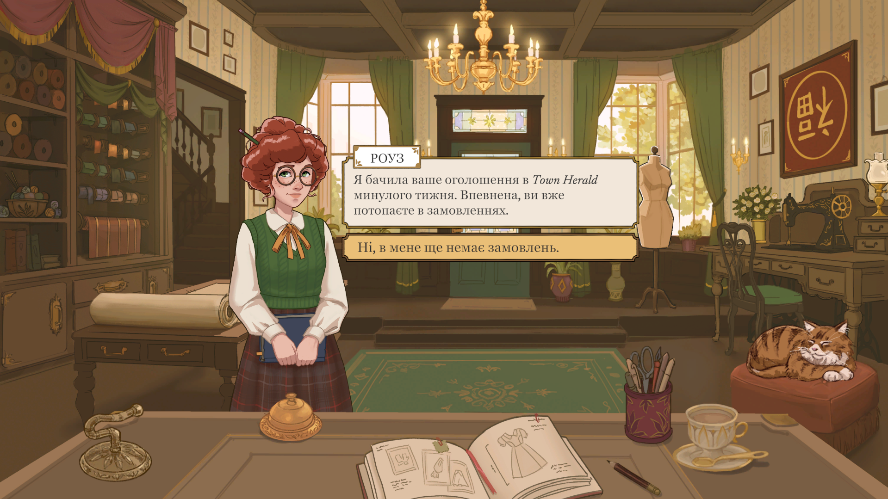
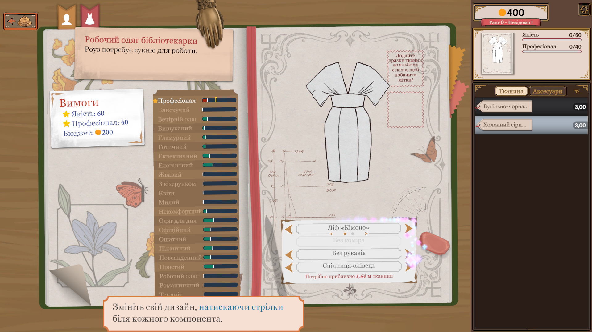

# Dressmaker: українська локалізація

Фанатська українська локалізація гри **Dressmaker** — затишного симулятора кравчині в місті Твіллфорд у стилі епохи Регентства.

- Перекладено **5551 рядок**: інтерфейс, туторіал, каталог тканин і деталей одягу, усі діалоги й світська хроніка.
- Переклад зроблено локальною LLM ([MamayLM](https://huggingface.co/INSAIT-Institute/MamayLM-Gemma-3-12B-IT-v2.0-GGUF), українська версія Gemma 3) з глосарієм, контекстом і коментарями розробників, другим проходом-вичиткою та частковою ручною редактурою.
- У гру переклад потрапляє через плагін для [BepInEx 5](https://github.com/BepInEx/BepInEx). Плагін додає мову «Українська» в меню гри і підключає шрифт з кирилицею. **Файли гри не змінюються**, тож оновлення Steam переклад не ламають.

## Скріншоти

| Головне меню | Налаштування |
|---|---|
|  |  |
| **Діалог** | **Альбом ескізів** |
|  |  |

## Встановлення

1. Завантажте `DressmakerUA-vX.Y.Z.zip` з розділу [Releases](../../releases).
2. Steam → Dressmaker → ПКМ → **Керування → Переглянути локальні файли**.
3. Розпакуйте **весь** вміст архіву в цю папку, поруч з `Dressmaker.exe`. Має вийти так:
   ```
   Dressmaker/
   ├── Dressmaker.exe
   ├── winhttp.dll
   ├── doorstop_config.ini
   └── BepInEx/
   ```
4. Запустіть гру. Якщо мова Windows українська, гра одразу буде українською. Інакше: **Налаштування → Мова → «Українська»**.

**Оновлення:** розпакуйте новий архів поверх старого.
**Видалення:** видаліть `winhttp.dll`, `doorstop_config.ini` і папку `BepInEx`.

**Якщо не працює:** перевірте, що файли лежать саме поруч з `Dressmaker.exe`, а не у вкладеній папці. Журнал лежить у `BepInEx/LogOutput.log`: шукайте рядки `Dressmaker Ukrainian`. Звіт про проблему додавайте в [Issues](../../issues) разом із цим файлом.

### Відомі обмеження
- Переклад машинний з частковою вичиткою, можливі неточності та кальки.
- У реченнях, куди гра підставляє колір чи тканину (`{0}`), узгодження може бути неідеальним.
- Картинки з текстом (логотип, заголовок газети) лишаються англійською.
- Кирилиця виводиться запасним шрифтом (системний Georgia), він відрізняється від оригінального стилю.

## Як долучитися

Найцінніша допомога — **вичитка й виправлення перекладу**. Програмувати для цього не потрібно.

### Повідомити про помилку в перекладі
Відкрийте [Issue](../../issues) і вкажіть:
- де саме в грі ви побачили рядок (сцена, персонаж, меню) або скріншот;
- поточний текст і ваш варіант.

### Отримати оригінальні тексти гри

Англійських текстів гри в репозиторії **немає**: вони належать розробникам. Кожен учасник дістає їх зі своєї копії гри (потрібна куплена Dressmaker).

**Потрібно:** Git, Python 3.10+, `pip install UnityPy pyyaml`.

```bash
python scripts/export_strings.py --game "D:\SteamLibrary\steamapps\common\Dressmaker"
```
Шлях до гри: Steam → Dressmaker → ПКМ → Керування → Переглянути локальні файли.
Скрипт читає англійські таблиці рядків прямо з файлів гри (`Dressmaker_Data/StreamingAssets/aa/StandaloneWindows64/localization-string-tables-english(en)_assets_all.bundle`) і створює `work/strings.json` з оригіналами та коментарями розробників. Цей файл лишається тільки на вашому комп'ютері, у Git він не потрапляє.

У `work/translations.json` для кожного рядка збережено лише переклад і короткий відбиток оригіналу (`src`). Якщо після оновлення гри англійський текст зміниться, скрипти це помітять: `review.py` позначить такі рядки, а `translate.py` перекладе їх заново.

### Виправити переклад самому

Спершу отримайте оригінальні тексти (див. вище).

1. Вивантажте всі рядки в таблицю:
   ```bash
   python scripts/review.py export
   ```
2. Відкрийте `work/review.csv` в Excel, LibreOffice чи Google Sheets. Колонки: `en` (оригінал), `uk` (переклад), `comment` (коментар розробників гри), `errors` (автоматичні зауваження).
3. Правте **лише колонку `uk`** і збережіть файл як **CSV UTF-8**.
4. Заберіть правки назад:
   ```bash
   python scripts/review.py import
   ```
   Змінені рядки отримують статус `manual`, і модель їх більше ніколи не перезапише. Скрипт одразу попередить, якщо правка ламає технічні правила.
5. Зробіть коміт змін у `work/translations.json` і відкрийте Pull Request.

Для перевірки проблемних місць є окремий файл: `python scripts/review.py export --errors` → `work/review_errors.csv`.

### Правила перекладу
Повний посібник зі стилю — у [`style_guide.md`](style_guide.md), терміни — у [`glossary.json`](glossary.json). Головне:

- **Не чіпайте технічні елементи.** Їх треба лишити точно як в оригіналі:
  - теги `<i>…</i>`, `<b>`, `<size=60%>`, `<style=c1>`, `<color=#…>`, `<shake>`, `<rainb>` тощо;
  - плейсхолдери `{0}`, `{1:0.00}`, `{0:list:{}|, }`;
  - префікс `QuestGiver:` з табуляцією;
  - `\n` (перенос рядка) та `\:` (екранована двокрапка).
- **Звертання.** До Кравчині (гравця) звертаються на «ви». Стать гравця не визначена, тому уникайте родових форм: «ви мали рацію», а не «ви була права».
- **Стиль.** Світська хроніка — манірна й іронічна, як у «Бріджертоні». Інтерфейс — коротко, як у сучасних іграх.
- **Імена й терміни.** Беріть їх з глосарію. Хочете змінити термін — змініть його в `glossary.json` і напишіть про це в Pull Request.
- **Типографіка:** лапки «…», тире —, апостроф ’.

### Зібрати й перевірити мод локально
**Потрібно:** .NET SDK 8+, гра з уже встановленим BepInEx (достатньо один раз розпакувати реліз).

```bash
python scripts/build_mod.py --install --game "D:\шлях\до\Dressmaker"
```
Команда збере плагін, експортує переклад і встановить його в гру. Перед запуском закрийте гру.

### Для розробників: конвеєр перекладу
Потрібно: Python 3.10+ з `pyyaml`, [Ollama](https://ollama.com) з моделлю
`hf.co/INSAIT-Institute/MamayLM-Gemma-3-12B-IT-v2.0-GGUF:Q8_0` і відеокарта на ~16 ГБ.

| Крок | Команда |
|---|---|
| Витягнути рядки з гри | `python scripts/export_strings.py --game <папка гри>` |
| Перекласти (можна перервати й продовжити) | `python scripts/translate.py` |
| Повторити рядки з помилками | `python scripts/translate.py --redo-errors` |
| Вичитка моделлю-редактором | `python scripts/proofread.py` (відкат: `--revert`) |
| Статистика | `python scripts/review.py stats` |
| Усе разом, на ніч | `python scripts/run_all.py` |
| Зібрати мод / архів для релізу | `python scripts/build_mod.py [--install] [--with-bepinex <папка BepInEx>]` |

Інша модель: `--model gemma4:26b-a4b-it-q4_K_M --no-think`.
Детальна технічна документація (формати даних, будова гри й плагіна): [`CLAUDE.md`](CLAUDE.md).

### Структура репозиторію
```
glossary.json           глосарій термінів
style_guide.md          інструкція для моделі = посібник зі стилю
work/translations.json  база перекладу, головний файл (лише український текст + відбиток оригіналу)
work/strings.json       оригінальні тексти гри (створюється локально, не комітиться)
scripts/                конвеєр перекладу та збирання мода
mod/DressmakerUA/       плагін BepInEx (C#)
mod/README_UA.txt       інструкція, що йде в архів релізу
```

## Подяки та ліцензії
- Гра **Dressmaker** і всі оригінальні тексти належать її розробникам. Це неофіційний фанатський проєкт. Репозиторій не містить текстів чи ресурсів гри.
- [BepInEx](https://github.com/BepInEx/BepInEx) (LGPL-2.1), [HarmonyX](https://github.com/BepInEx/HarmonyX).
- [MamayLM](https://huggingface.co/INSAIT-Institute) від INSAIT.
